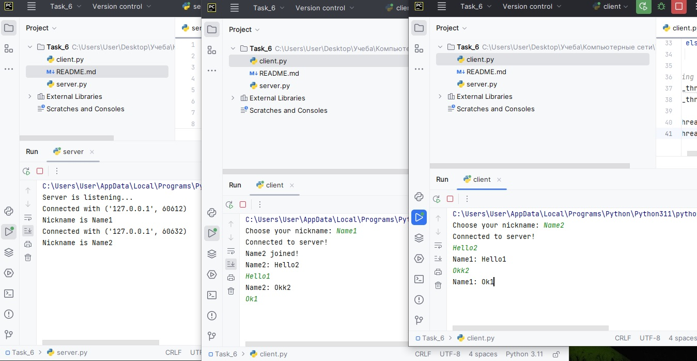
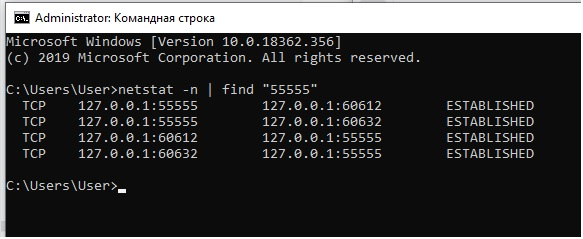
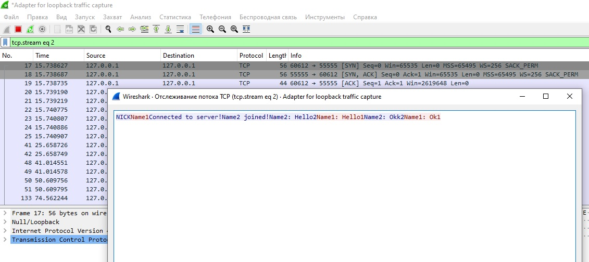

# Компьютерные сети (семинары)
## Урок 6. Основы компьютерных сетей. Транспортный уровень. UDP и TCP.

Код представляет собой простой сервер для чата, написанный на Python, с использованием сокетов. Возможности сервера включают в себя отправку и прием сообщений от клиентов, а также поддержку команд `/block` и `/unblock` для блокировки и отмены блокировки пользователей. Клиенты могут подключаться к серверу, выбирать никнейм и обмениваться сообщениями в чате. Сервер хранит информацию о блокировках для каждого клиента и блокирует передачу сообщений от заблокированных пользователей.

Скриншот работы чата

Скриншорт команды netstat

Перехват трафика
